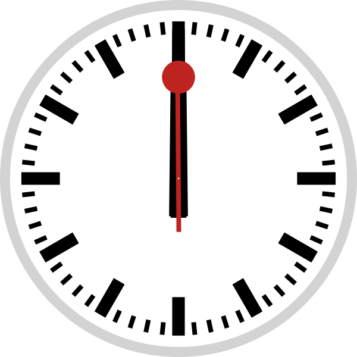

# SVG clock

[](https://raw.githubusercontent.com/tomchen/svg-clock/master/clock.svg)

## Technical details

SMIL-based animation

Use JavaScript to set the current time

## GitHub usage

GitHub sanitizes JavaScript but keeps SMIL-based animation in SVG, therefore, **what you see on GitHub README.md page is an animated clock starting from 00:00**. If you open [the SVG file](https://raw.githubusercontent.com/tomchen/svg-clock/master/clock.svg) directly in your browser, the animated clock should start from the current time.

Use it (Markdown, can't set width and height):

```markdown

```

Use it (HTML, with width and height set):

```html

```

## Design

Yes it's highly similar to a [Swiss railway clock](https://en.wikipedia.org/wiki/Swiss_railway_clock) whose design [**IS COPYRIGHTED**](https://www.businessinsider.fr/us/apple-paid-21-million-for-swiss-railways-clock-2012-11).

## Credits

By Tom Chen

Inspired by SVG animation: by HackaLittleBit (https://commons.wikimedia.org/wiki/File:Swiss_railway_clock_1.svg), CC-by-sa 4.0, whose original SVG is: by Jahoe (https://commons.wikimedia.org/wiki/File:Swiss_railway_clock.svg), CC-by-sa 3.0 & GFDL

(The current SVG code has significate code change comparing to HackaLittleBit's work, and is using the permissive MIT license)

## License

MIT license for the code, but Swiss railway clock **design is copyrighted**.
